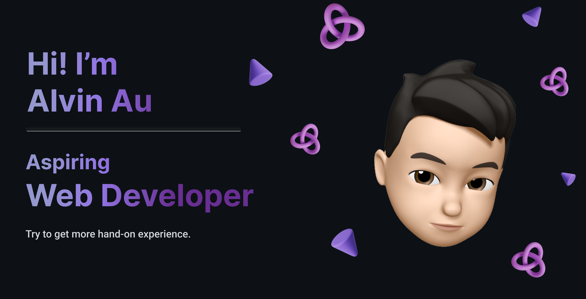

## Hi! I'm Alvin Au

  

  
  &nbsp;
  
  &nbsp;
  
  &nbsp;
  
  &nbsp;
  
  &nbsp;
  
  &nbsp;
  
  &nbsp;

## Find me around the web
- :mag_right: Know more about me on [Portfolio](https://alvinau.dev/) or [Blog](https://blog.alvinau.dev/)
- :briefcase: Keep updates profile on [LinkedIn](https://www.linkedin.com/in/alvinau0427/)
- :email: Reach me by email to alvinau0427@outlook.com
- :speech_balloon: Ask me about anything in [here](https://github.com/alvinau0427/alvinau0427/issues)
